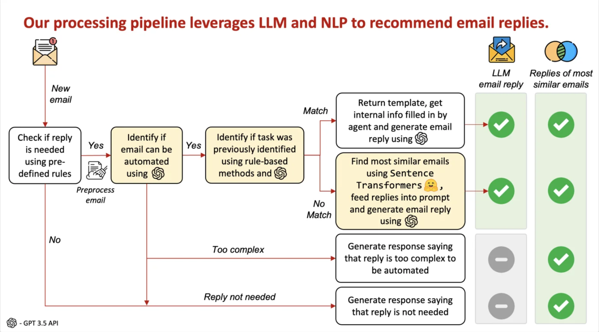
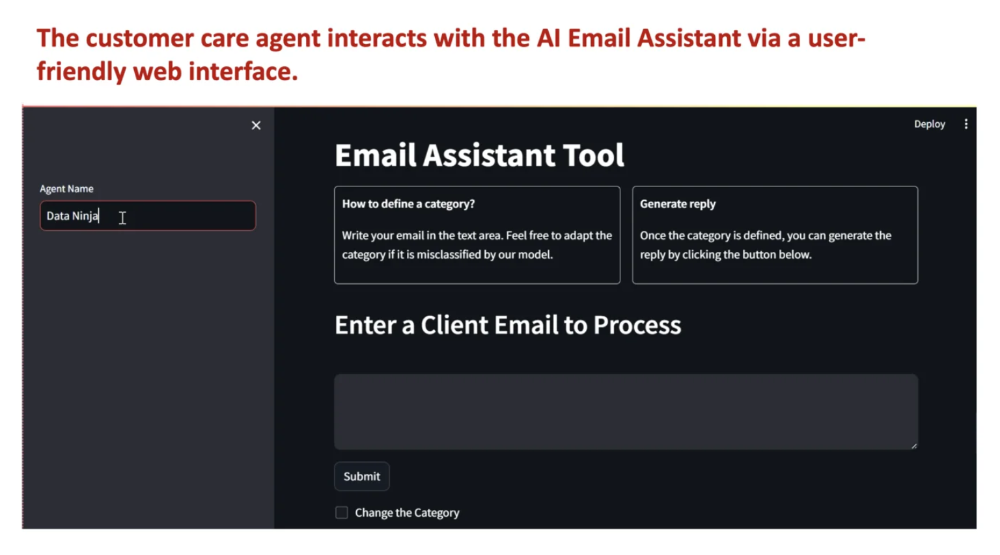
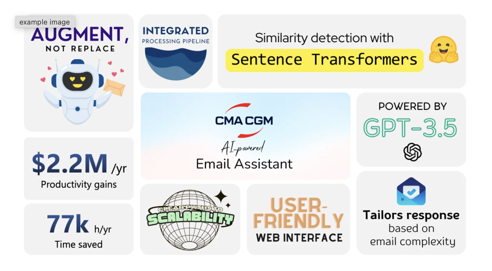

# About

Hello there! 👋

I’m Raghav, a Masters of Business Analytics candidate at MIT graduating in August 2024. I am currently working as a Graduate Research Assistant under the supervision of Professor Swati Gupta in the Operations Research Center in collaboration with Massachusetts General Hospital, applying machine learning in kidney transplant allocation.

I graduated with Highest Honors with a degree in Biomedical Engineering from Georgia Institute of Technology in May 2023. I worked as a research assistant in 2021 under the supervision of Professor Ahmet Coskun applying machine learning in prostate cancer. I also did a couple of internships at Abiomed and Flow MedTech as a Product Development Co-op and Engineering Intern respectively.

I am an aspiring data scientist passionate about applying machine learning to improve business decisions.

Please feel free to reach out to me on: 
Email: rj30@mit.edu 
LinkedIn: [LinkedIn](https://www.linkedin.com/in/rrmj/) 
Github: [GitHub](https://github.com/raghavmanoharanjayanthi30) 

Happy to connect and have a discussion!

# Projects
## MIT Analytics Lab: Building CMA CGM's First AI-Powered Email Assistant

<b>Background and Problem Statement <b> 
CMA CGM is the largest shipping company in the United States and handles more than 100k emails a week. However, they are currently processed manually by customer agents. There is a need for email classification and automating response generation to these emails

<b>Proposed Solution<b>  
Built an AI email assistant that generates recommended replies to emails based on the task to be completed and further input from the customer agent.

<b>Actions<b>

<b>Impact<b>
Projected to reduce time spent on email replies by 38.1%, leading to time savings of over 77k hours/year and $2.2M in productivity improvements/year.

<b>Learnings<b>

